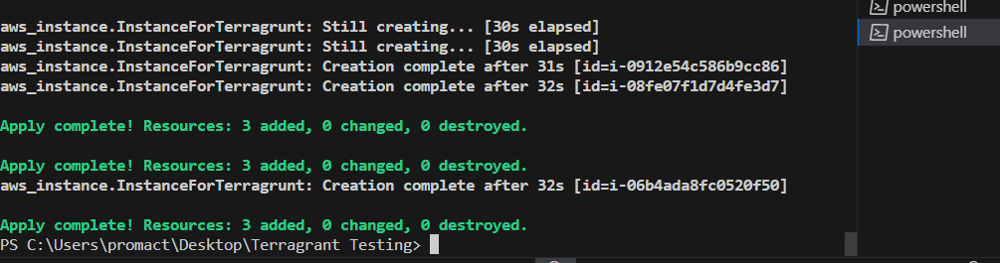

 

 <strong>
 Terraform with Terragrunt for Multiple Environments.
 </strong>

 Objective: Set up Terraform configurations for different environments (e.g., dev, staging, prod) using Terragrunt.

Description:

This project directory is structured to organize Terragrunt configurations for managing multiple environments efficiently. Each environment (e.g., dev, staging, prod) has its own Terragrunt configuration file referencing a common Terraform module. The Terragrunt configurations define environment-specific variables and settings tailored to each environment's requirements.

Overview:

The directory structure is designed to organize Terragrunt configurations for different environments, ensuring a systematic approach to managing infrastructure across multiple environments.

Each environment (dev, staging, prod) has its own dedicated directory containing a Terragrunt configuration file specific to that environment.

The Terragrunt configuration files reference a common Terraform module, enabling code reusability and ensuring consistency across environments.

Environment-specific variables are defined within the Terragrunt configuration files, allowing for customization of settings and parameters based on the requirements of each environment.

To deploy each environment separately, users can navigate to the corresponding directory and execute Terragrunt commands (e.g., terragrunt init, terragrunt apply) to initialize and apply the configurations without error.

Requirements

-•	Terraform v1.7.3 installed on Windows_amd64.

                terraform --version

-•	Terragrunt should be installed.

               terragrunt --version

-•	An AWS account with permissions to create and manage S3 buckets and DynamoDB tables.

-•	AWS credentials configured locally on the machine.

|Tool|Version|Description|
|--|--|--|
|terrform|v1.7.3|Infrastructure as Code tool for building, changing, and versioning infrastructure safely and efficiently. |
|terragrunt|v0.55.1| Thin wrapper for Terraform that provides extra tools for working with multiple Terraform modules. |

|AWS resource | Name | ARN link | Description|
|--|--|--|--|
|S3 Bucket|terraformsunny|arn:aws:s3:::terraformsunny|Object storage service used for storing Terraform state files remotely.|
|IAM Role|terraform|arn:aws:iam::730335487196:role/terraform|IAM role assumed by Terraform or Terragrunt for AWS operations.|
| IAM Policy |Terraform-access|arn:aws:iam::730335487196:policy/Terraform-access|Policy attached to the IAM role defining permissions for AWS resources.|
|DynamoDB Table|terraform-table|arn:aws:dynamodb:ap-south-1:730335487196:table/terraform-table|Table used for state locking in Terraform remote state configuration.|
| IAM User |terraform-sunny|arn:aws:iam::730335487196:user/terraform-sunny/terraform-table|IAM user with necessary permissions for Terraform and Terragrunt.|
|IAM group|terraform-group|arn:aws:iam::730335487196:group/terraform-group|IAM group with necessary permissions for Terraform and Terragrun.|

Setup Terraform Environment

Setup Enviroment

-•	Initialize Terraform:

               terraform init

-•	Run terraform init in an empty directory where you plan to store your Terraform configurations.

Directory Structure :

Environments/

- Development
  - Instances
  - VPC
- Production
  - Instances
  - VPC
- Staging
  - Instances
  - VPC

Module/
 -Instanc
 -VPC

 For Instance Module:
-1.	Create a main.tf file for resource configurations.

-2.	Define input variables in variables.tf.

-3.	Create Instances.tf for instance configurations.

-4.	Add key-pair.tf for attaching keys.

-5.	Include security-group.tf for security group settings.

For VPC Module:

-1.	Create Vpc_subnet.tf to configure VPC and subnet.

-2.	Define outputs in outputs.tf.

-3.	Use variable.tf to define input variables for module configurations.

Terragrunt Configuration

-1.	Common Terragrunt Settings:

-•	Inside the environment directory, create a terragrunt.hcl file to configure common settings, such as remote state management and backend configurations shared across multiple environments or modules.

**terragrunt.hcl**

Prerequisite: 

You need an AWS account with the necessary permissions to create and manage S3 buckets and DynamoDB tables.

IAM user policy:

               {
    "Version": "2012-10-17",
    "Statement": [
        {
            "Effect": "Allow",
            "Action": "*",
            "Resource": "*"
        }
    ]
   }
AWS Account with Permissions:

Policy:

                {
    "Version": "2012-10-17",
    "Statement": [
        {
            "Effect": "Allow",
            "Action": "sts:AssumeRole",
            "Resource": "arn:aws:iam::730335487196:role/terraform"
        }
    ]
               }

Terraform requires access to AWS services to provision and manage resources. To interact with S3 buckets and DynamoDB tables for remote state management, your AWS account must have the appropriate IAM permissions.

IAM Permissions: 
AWS Credentials Configured Locally: AWS credentials need to be configured locally on the machine where Terraform commands will be executed.

Configuration Methods:

Environment Variables: Alternatively, you can set the AWS_ACCESS_KEY_ID, AWS_SECRET_ACCESS_KEY, and AWS_DEFAULT_REGION environment variables to specify AWS credentials.

|configuration block| name | description|
|----|----|----|
|backend|s3|Configuration block for specifying remote state management using an S3 backend.|
|path|state.tf|Configuration block for specifying remote state management using an S3 backend.|
|if_exists|overwrite_terragrunt||
|profile|terraform-sunny|AWS profile name used for authentication.|
|role_arn|arn:aws:iam::730335487196:role/terraform|	ARN of the IAM role assumed by Terraform for AWS operations.|
|bucket|terraformsunny|Name of the S3 bucket to store Terraform state files.|
|dynamodb_table|terraform-table|Name of the DynamoDB table used for state locking.|
|region|ap-south-1|AWS region where the S3 bucket is located.|

Before applying any configurations, initialize the Terragrunt environment by running terragrunt init.

Purpose: The terragrunt init command is used to initialize a Terragrunt project. It sets up the working directory and prepares it for Terragrunt's use.

What it does:

Downloads the necessary Terraform configurations, modules, and providers specified in the Terragrunt configuration files (terragrunt.hcl).

Terragrunt Planning (plan):

Purpose: The terragrunt plan command generates an execution plan, showing what actions Terraform will take to change the infrastructure based on the defined configurations.

What it does:

Analyzes the Terraform configurations and compares them to the current state of the infrastructure.

Terragrunt Apply (apply):

Purpose: The terragrunt apply command is used to apply the Terraform configurations and make changes to the infrastructure as specified.

What it does:

Executes the planned actions generated during the terragrunt plan phase.
Creates, modifies, or deletes resources according to the defined configurations.
Updates the Terraform state file to reflect the changes made to the infrastructure.

Final Output:

